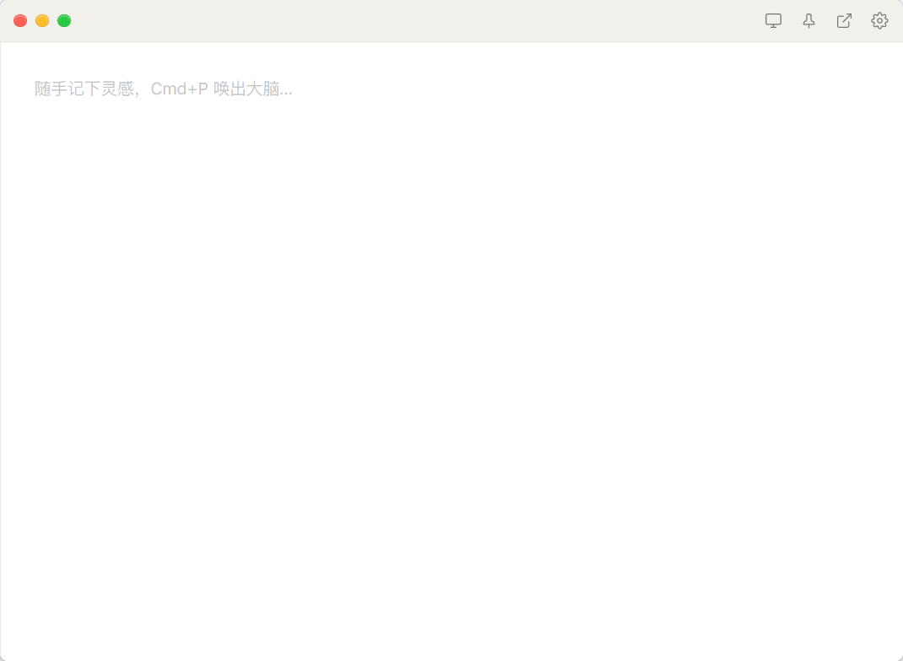
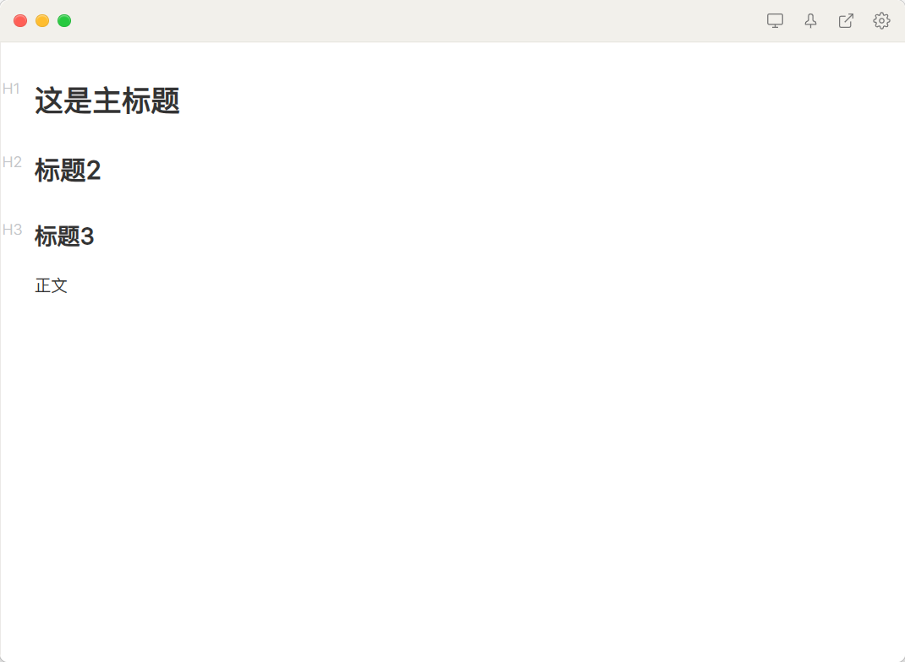
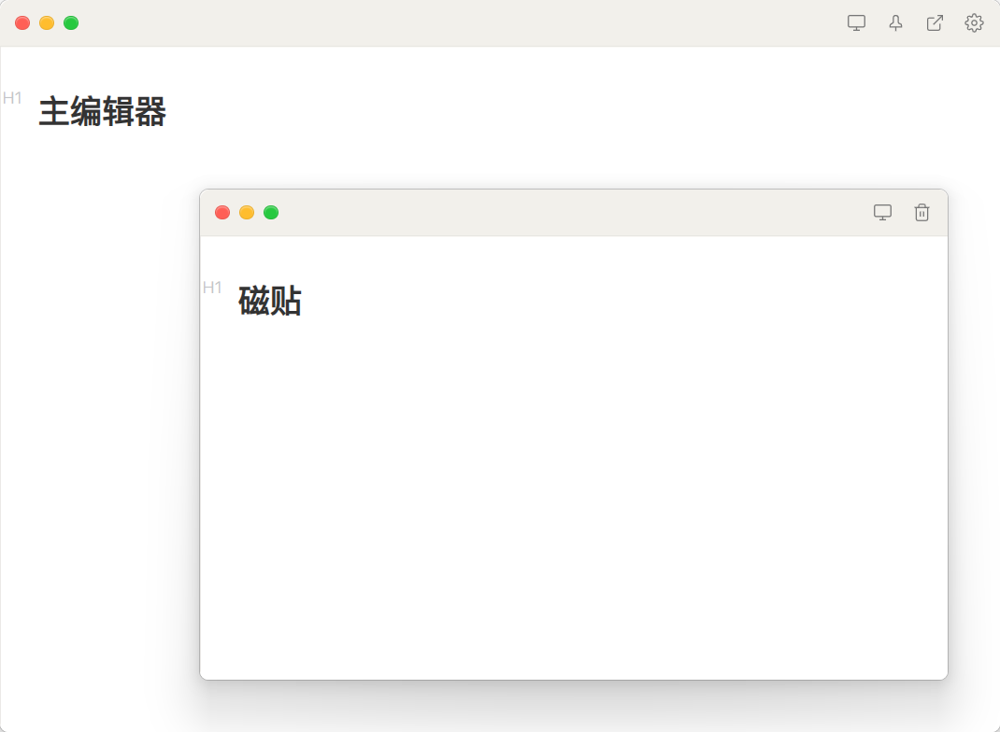
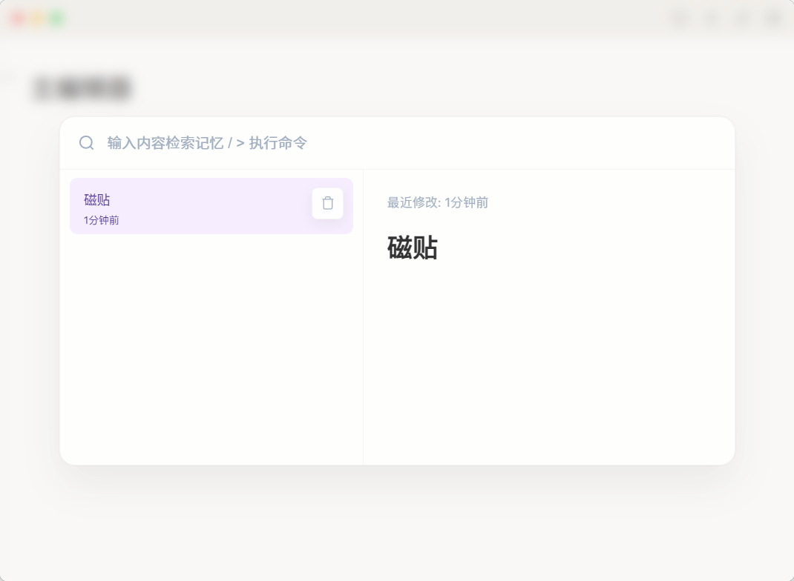

<div align="center">
  <h1>
    <a href="#readme" style="cursor: default; text-decoration: none; color: inherit;">
      
    </a>
    TearNote
  </h1>
  <p>把记忆撕成碎片，贴在触手可及的地方。</p>
</div>
<div align="center">
  <a href="https://github.com/momo-12138/TearNote/releases">
    
  </a>
  <a href="https://github.com/momo-12138/TearNote/actions/workflows/release.yml">
    
  </a>
  <a href="https://github.com/momo-12138/TearNote/blob/main/LICENSE">
    
  </a>
</div>


<p align="center">
  
  
  
</p>

TearNote 旨在为你提供一个**闪电般极速、零干扰**的桌面记录体验。基于 Tauri 构建，告别臃肿的 Electron 架构；采用纯本地存储，你的数据 100% 属于你自己。

## 📷 界面预览

<p align="center">
  
  
</p>

<p align="center">
  <sub>主界面（快速记录） · 编辑器（Markdown 写作）</sub>
</p>

<p align="center">
  
  
</p>

<p align="center">
  <sub>独立磁贴（专注记录） · 搜索界面（快速检索）</sub>
</p>

## ✨ 核心特性

- ⚡ **极速与轻量**：基于 Tauri v2 + Rust 构建，启动快如闪电，极低的内存占用。
- 🔒 **本地优先 (Local-first)**：所有便签数据均以本地文件安全存储。无云端同步焦虑，保护绝对隐私。
- 📌 **桌面磁贴模式 (Stickers)**：支持将灵感便签“撕下”悬浮在桌面，随用随写，支持窗口置顶与沉浸式 Inbox 模式。
- 🔍 **全局大脑 (Command & Search)**：内置全局搜索与命令面板，支持模糊检索、实时预览与快捷指令。
- ✍️ **强大的 Markdown 体验**：内置 [Vditor](https://b3log.org/vditor/) 编辑器，支持所见即所得、代码高亮、数学公式与图表渲染。
- 💻 **跨平台支持**：全面兼容 Windows 与 macOS。

## ⌨️ 快捷键指南

- <kbd>Ctrl/Cmd</kbd> + <kbd>P</kbd> ：唤出记忆网络（全局搜索）
- <kbd>Ctrl/Cmd</kbd> + <kbd>Shift</kbd> + <kbd>P</kbd> ：直接进入命令面板模式（输入 `> pin` / `> clear`）
- <kbd>Esc</kbd> ：关闭搜索面板

## 📥 下载与安装

前往项目的 [Releases 页面](https://github.com/momo-12138/TearNote/releases) 下载适用于你操作系统的最新安装包：
- **Windows**：`.msi` / `.exe`
- **macOS**：`.dmg`

## 🛠️ 本地开发指南

如果你想在本地运行或开发 TearNote，请确保你的电脑已安装 [Node.js](https://nodejs.org/) 和 [Rust 环境](https://www.rust-lang.org/tools/install)。
*(注：首次开发 Tauri 项目，请参考 [Tauri 官方文档](https://tauri.app/v1/guides/getting-started/prerequisites) 安装系统所需的构建依赖)*

### 1. 克隆仓库
```bash
git clone https://github.com/momo-12138/TearNote.git
cd TearNote
```

### 2. 安装依赖
```bash
npm install
```

### 3. 启动开发环境

```bash
npm run tauri dev
```

### 4. 构建打包

```bash
npm run tauri build
```

## 📄 开源协议

本项目基于 [MIT License](./LICENSE) 开源。

------

<div align="center">Made with ❤️ by TearNote Project</div>
